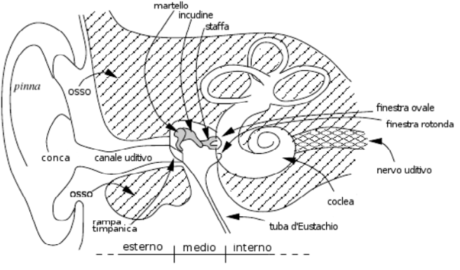
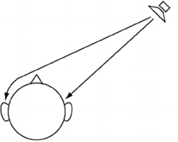
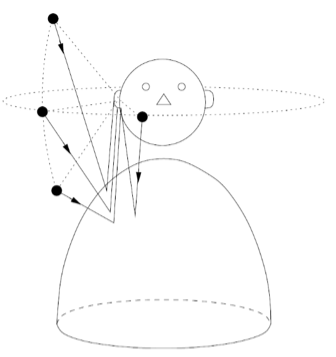
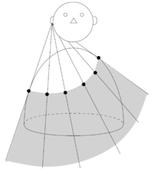
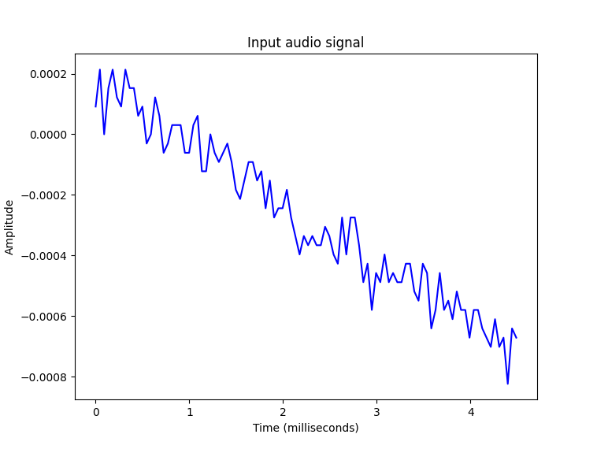

## Sistema Uditivo e trasformata di _Fourier_
Approfondimento Principi e Modelli della Percezione a cura di _Edoardo Giorgianni_ e _Kristian Fabbro_.

[Consulta la presentazione](https://www.canva.com/design/DAF2evizlIY/g0-kZHcZTRG3HF4ySbb7Ag/edit?utm_content=DAF2evizlIY&utm_campaign=designshare&utm_medium=link2&utm_source=sharebutton)

## Indice
1. [Introduzione](#introduzione)
2. [Apparato Uditivo](#apparato-uditivo)
      - [Orecchio esterno](#orecchio-esterno)
      - [Orecchio medio](#orecchio-medio)
      - [Orecchio interno](#orecchio-interno)
3. [Modello Strutturale](#modello-strutturale)
      - [Testa](#testa)
      - [Orecchio esterno](#orecchio-esterno-1)
      - [Torso e Spalle](#torso-e-spalle)
4. [Reti Neurali](#reti-neurali)
5. [Riconoscimento Vocale](#riconoscimento-vocale)
      - [Lettura di un file audio e generazione di un grafico](#primo-passo-lettura-di-un-file-audio-e-generazione-di-un-grafico)
      - [Trasformazione delle frequenze audio](#secondo-passo-trasfromazione-delle-frequenze-audio)
      - [Segnali Monotoni](#importanza-dei-segnali-audio-monotoni)
      - [Estrazione delle feature dal discorso](#terzo-passo-estrazione-delle-feature-dal-discorso)
      - [Riconoscimento delle parole parlate](#quarto-passo-riconoscimento-delle-parole-parlate)
6. [Trasformata di _Fourier_](#trasformata-di-fourier)

***

### Introduzione
In questo trattato introdurremo le principali componenti del sistema uditivo umano, per poi giungere alla spiegazione dell'applicazione della trasformata di _Fourier_ per il riconoscimento vocale.

***

### Apparato uditivo
Per rispondere razionalmente agli stimoli prodotti dall’ambiente circostante, l’uomo utilizza i **cinque sensi**. L'**udito** è uno di questi. L’organo che permette di percepire i suoni è l’**orecchio**, suddiviso in **esterno**, **medio** e **interno**.

<p align="center">
  
</p>

#### Orecchio esterno
Il ruolo principale dell'**orecchio esterno** è quello di _convogliare_ il _suono_, attraverso il timpano, verso l’orecchio medio.
È formato da:
- **pinna** (o padiglione auricolare): _localizza_ il _suono_ nello spazio, svolgendo la funzione di _antenna acustica_

- **canale uditivo esterno**: _tubo_ di larghezza costante con pareti ad alta impedenza acustica. Svolge il ruolo di _risonatore bidimensionale_

- faccia esterna del **timpano**: guarda in direzione dell'_apertura_ del _condotto uditivo esterno_

#### Orecchio medio
Ruolo fondamentale dell'**orecchio medio** è quello di _trasformatore_ il _suono_ in energia meccanica.
Contiene tre ossicini:
- **martello**: è la parte più grande e la sua funzione principale è quella di _trasmettere_ all’_incudine_ le _vibrazioni_ che le onde sonore producono sulla membrana del timpano.

- **incudine**: ha dimensioni di circa 7 mm ed è situato tra il martello e la staffa. Svolge la funzione di _trasmettere_ le _vibrazioni_ prodotte dalle onde sonore.

- **staffa** (collegata con l’orecchio interno): è il più leggero degli ossicini ed è situato tra l'incudine e la finestra ovale.
Il suo ruolo è quello di _collegare_ l'_orecchio interno_, permettendo la _comunicazione_ tra essi.
Un gioco di leve tra gli ossicini che compongono la staffa, provoca il suo spostamento, e quindi il raddoppio dell'energia trasmessa.

#### Orecchio interno
Le componenti principali dell’orecchio interno, che permette di percepire il suono, sono **coclea** e **finestra ovale**. Il collegamento tra orecchio medio e interno avviene mediante il collegamento tra la staffa e l’interno della coclea.

***

### Modello strutturale
Il modello strutturale permette di differenziare le componenti dell’essere umano che permettono di identificare i percorsi che le onde sonore percorrono per arrivare al timpano. 

#### Testa
La testa è un _ostacolo_ per la libera _propagazione_ del _suono_ e per questo motivo introduce _due effetti_ principali:
- **ITD** (_Interaural Time Difference_); causato dal fatto che le onde sonore devono percorrere una _maggiore distanza_ per raggiungere l’_orecchio più lontano_. Per intendere ciò è sufficiente considerare una sorgente e la testa come sferica. Come si può notare dalla figura, delle banali considerazioni geometriche permettono di affermare che il raggio per raggiungere l’orecchio più lontano è maggiore rispetto a quello dell'orecchio più vicino   


- **ILD** (_Interaural Level Difference_); esprime la condizione secondo la quale l’_orecchio più lontano_ riceve un _suono_ di _minore intensità_. L'_ILD_ è fortemente legato alla _frequenza_: a basse frequenze non vi è alcuna differenza, mentre ad alte frequenze diventa particolarmente significativo

#### Orecchio esterno
Come mostrato precedentemente, l’orecchio esterno è caratterizzato dalla pinna, dal canale uditivo e dal timpano. La pinna è connessa al canale uditivo. L'orecchio esterno influenza la formazione del suono che arriva al timpano. Ruolo fondamentale dell'orecchio esterno è contribuire alla percezione del suono **amplificando** le **onde acustiche** con **frequenza** attorno ai **3.000 Hz** (frequenza del parlato) e indirizzandole verso il timpano, sede in cui avverrà una loro ulteriore amplificazione.

#### Torso e Spalle
Torso e spalle influenzano il suono che arriva al timpano, introducendo due contributi: **riflessione sonora** ed **effetto di oscuramento**. La sagoma delle due parti assomiglia a un pupazzo di neve, per questo motivo il modello viene chiamato _snowman model_.
- **Riflessioni**: quando si misura la risposta impulsiva all'orecchio destro, l'impulso iniziale è seguito da una serie di altri impulsi, il cui ritardo varia in base all'elevazione della sorgente sonora. Si può utilizzare la geometria semplificata del _modello snowman_ per calcolare i _ritardi_ dei _raggi riflessi_, considerando i parametri del modello e la posizione della sorgente sonora. Il ritardo tra il suono diretto e il riflesso non varia significativamente se la sorgente si muove su una _circonferenza orizzontale_, ma varia sensibilmente se si muove _verticalmente_.  


- **Oscuramento**: man mano che la sorgente si muove verso il basso, le _riflessioni scompaiono_, dando spazio all'effetto di oscuramento. I raggi che vanno dall'orecchio ai punti di tangenza della parte superiore del torso delimitano il _cono di oscuramento_.  


***

### Reti neurali
Le reti neurali sono fondamentali nel funzionamento del sistema uditivo. Il sistema uditivo del cervello è complesso e coinvolge una serie di reti neurali che lavorano insieme per **elaborare** le **informazioni uditive**, consentendoci di percepire e comprendere i suoni.
Le reti neurali includono:
1. **Corteccia uditiva**; è la parte principale del cervello coinvolta nella percezione uditiva. La corteccia uditiva è divisa in varie aree specializzate che gestiscono specifiche informazioni sui suoni, come la loro _frequenza_, _intensità_ e _localizzazione_. Le reti neurali presenti in questa zona rappresentano e interpretano i segnali uditivi

2. **Via uditiva**; questa via coinvolge una serie di strutture neurali che _trasmettono i segnali uditivi dal condotto uditivo all'orecchio interno e poi al cervello_. Essa include il _tronco encefalico_, il _talamo_ e altre strutture intermedie

3. **Plasticità cerebrale**; le reti neurali nel cervello, comprese quelle coinvolte nel sistema uditivo, possono _modificarsi_ e _adattarsi_ attraverso la plasticità cerebrale. Ciò significa che il cervello può cambiare la sua organizzazione in risposta all'_apprendimento_ e all'_esperienza uditiva_.
Ad esempio, imparare a suonare uno strumento musicale può portare a cambiamenti nelle aree cerebrali dedite al riconoscimento dei suoni musicali

4. **Integrazione sensoriale**; il sistema uditivo interagisce con altri sistemi sensoriali, come la vista, per fornire un'esperienza completa e integrata del mondo circostante.
Le reti neurali sono coinvolte nell'elaborazione delle _informazioni uditive_ in relazione a quelle _visive_, _tattili_ e di altri sensi, contribuendo a creare una visione complessiva della realtà.

In sintesi, le reti neurali svolgono un ruolo centrale nel sistema uditivo, contribuendo alla **percezione**, all'**elaborazione** e all'**interpretazione** dei **suoni** nell'ambiente circostante.

***

### Riconoscimento vocale
Un generico sistema di _Speech Recognition_ è progettato per eseguire tre task:
1. la **cattura** delle **parole** e delle **frasi** dette da un essere umano. Questo passaggio si concentra quindi solo sulla parte di workflow relativa all’**acquisizione** dei **dati**;

2. l’applicazione del _Natural Language Processing_ sui dati acquisiti, per **riconoscere** il **contenuto** del **discorso**;

3. la **sintesi** delle **parole riconosciute** per aiutare una macchina a parlare lo stesso linguaggio.

Affinché una macchina possa elaborare informazioni come quelle uditive, bisogna memorizzare tali dati sotto forma di **segnali digitali** e analizzarli con dei programmi ad hoc.

I processi per convertire un segnale analogico in digitale sono campionamento e quantizzazione.
- **Campionamento**: è la procedura usata per **convertire** un **segnale `s(t)`**, che varia in funzione del tempo, **in una progressione discreta `x(n)`** composta da numeri reali. L’intervallo tra due campioni consecutivi è il **periodo** di **campionamento `Ts`**

- **Quantizzazione**: è il processo di sostituzione dei numeri reali del campionamento in **valori approssimati** definiti in un certo intervallo di bit (solitamente si usano 16 bit). La risoluzione dei campioni, si misura in _bit/sample_.

***

Nel seguito sarà mostrato del codice _Python_ per effettuare il riconoscimento vocale.

#### Primo passo: lettura di un file audio e generazione di un grafico
Lo step iniziale di un algoritmo di _speech recognition_ è la creazione di un sistema in grado di leggere file audio (.wav, .mp3, ecc) e di capirne le informazioni presenti all’interno. _Python_ dispone di librerie per leggere e interpretare questi file. Impostiamo il nostro ambiente di sviluppo per far sì che tutti i seguenti codici funzionino. Installiamo le seguenti librerie:
```text
$ pip install numpy matplotlib scipy
```
Utilizzata per lo step [uno](#primo-passo-lettura-di-un-file-audio-e-generazione-di-un-grafico) e [due](#secondo-passo-trasfromazione-delle-frequenze-audio) e per i [segnali monotoni](#importanza-dei-segnali-audio-monotoni).
```text
$ pip install python_speech_features
```
```text
$ pip install numpy matplotlib scipy python_speech_features
```
Utilizzate per lo [step tre](#terzo-passo-estrazione-delle-feature-dal-discorso) (sia per MFCC che per Filter Bank).
```text
$ pip install SpeechRecognition
```
```text
$ pip install pipwin
```
```text
$ pip install pyaudio
```
Utilizzate per lo step quattro **[inserire link]**.

SciPy (`scipy.io`) dispone di vari metodi per effettuare operazioni coi file in _Python_ (nel nostro caso la usiamo per la lettura, step uno e due, o la scrittura, segnali monotoni, del file audio).   
NumPy (`numpy`) è una libreria _Python_ per la computazione scientifica.   
Matplotlib (`matplotlib.pyplot`) è una libreria _Python_ per la visualizzazione dei dati.   
La libreria open–source `pyaudio` consente di registrare l'audio tramite un microfono collegato all'ambiente di sviluppo e analizzarlo con _Python_ in tempo reale. L'installazione di _PyAudio_ varia in base al sistema operativo.

Lo scopo di questo step è visualizzare i segnali audio come **punti strutturati**, cioè sotto forma di curva all’interno di un **grafico**.

- **Registrazione**: una registrazione è il _file_ fornito in input all’algoritmo, il quale ne analizza il contenuto e costruisce un modello di _speech recognition_. Questo record può essere un file in memoria oppure può essere registrato live e _Python_ permette di lavorare con entrambi i casi (noi vedremo la lettura di un file in memoria locale).

- **Campionamento**: tutti i segnali di una registrazione vengono salvati in forma digitale. I digit sono difficili da elaborare per un software, dal momento che le macchine lavorano con input numerici. Il campionamento è infatti la tecnica usata per _convertire i segnali digitali in segnali numerici discreti_. Il campionamento viene fatto a una certa frequenza e genera segnali numerici. La scelta dei livelli di frequenza dipende dalla percezione del suono, ad esempio si sceglie una frequenza elevata se percepiamo l’audio come continuo.

```python
# Fonte dell’audio: 'fileAudio.wav'
# Importiamo le librerie necessarie
import numpy as np
import matplotlib.pyplot as plt
from scipy.io import wavfile

# Leggiamo il file audio e verifichiamo la dimensione del segnale e la frequenza di campionamento
# Forniamo il percorso del file
freq_sample, sig_audio = wavfile.read("fileAudio.wav")

# Parametri di output: dimensione del segnale, frequenza di campionamento e durata
print('\nShape of Signal:', sig_audio.shape)
print('Signal Datatype:', sig_audio.dtype)
print('Signal duration:', round(sig_audio.shape[0] / float(freq_sample), 2),
      'seconds')

# Normalizziamo i valori del segnale
pow_audio_signal = sig_audio / np.power(2, 15)

# Estraiamo i primi 100 valori
pow_audio_signal = pow_audio_signal[:100]

# Creiamo l'asse del tempo in millisecondi
time_axis = 1000 * np.arange(0, len(pow_audio_signal), 1) / float(freq_sample)

# Visualizziamo il segnale su un grafico
plt.plot(time_axis, pow_audio_signal, color='blue')
plt.xlabel('Time (milliseconds)')
plt.ylabel('Amplitude')
plt.title('Input audio signal')
plt.show()
```

_Output_:
```
$ python step_uno_letturaFile.py 

Shape of Signal: (66150,)
Signal Datatype: int16
Signal duration: 3.0 seconds
```


***

#### Secondo passo: trasfromazione delle frequenze audio
La rappresentazione di un file audio viene fatta, in primo luogo, nel dominio del tempo per ottenere l’intensità (ampiezza) dell’onda sonora. Il limite di questa misurazione è che essa si concentra solo sul volume dell’audio.
Per questo motivo, il suono viene osservato nel **dominio delle frequenze**. Questo tipo di rappresentazione ci fornisce dettagli sulla presenza di variazioni di frequenza all’interno del segnale. Il concetto matematico usato per la conversione di un segnale continuo dal dominio del tempo a quello delle frequenze è la **_Trasformata di Fourier_**. Useremo la trasformata di Fourier (**FT**) in _Python_ per _convertire i segnali audio in rappresentazioni basate sulla frequenza_.

**Trasformata di _Fourier_ in _Python_**

I segnali audio sono tutti composti da un insieme di tante onde di frequenza, che viaggiano insieme per creare una perturbazione nel mezzo di trasmissione, che può essere, ad esempio, una stanza. Per catturare il suono è fondamentale catturare l’intensità di frequenza generata nello spazio da queste onde.

La trasformata di _Fourier_ permette di **decomporre un segnale estraendo le singole frequenze**. Questo è fondamentale per comprendere quali sono le frequenze che si combinano insieme nel formare i suoni che ascoltiamo. La trasformata di _Fourier_ (FT) fornisce tutte le frequenze presenti nel segnale e mostra anche l'ampiezza di ciascuna di esse.
Nella sezione di codice che segue, trasformeremo il file `fileAudio.wav` nel suo dominio di frequenza, rappresentando le singole frequenze e la loro ampiezza.

<p align="center">
  
</p>

La funzione `np.fft.fft` di NumPy, nel codice successivo, ci permette di calcolare una trasformata discreta di _Fourier_ monodimensionale. La funzione usa l’**algoritmo _Fast Fourier Transform_** (FFT) per convertire una sequenza data in una trasformata di _Fourier_ discreta (DFT). Nel file che stiamo elaborando, abbiamo una sequenza di ampiezze tratte da un file audio che erano state originariamente campionate da un segnale continuo. Useremo la funzione **FFT** per convertire questo dominio del tempo in un segnale discreto nel dominio della frequenza.

```python
# Caratterizzazione del segnale dal file di input
# Useremo la trasformata di Fourier per convertire i segnali in una distribuzione sul dominio di frequenza
import numpy as np
import matplotlib.pyplot as plt
from scipy.io import wavfile

# Leggiamo il file audio e otteniamo la frequenza di campionamento e il segnale
freq_sample, sig_audio = wavfile.read("fileAudio.wav")
print('\nShape of the Signal:', sig_audio.shape)
print('Signal Datatype:', sig_audio.dtype)
print('Signal duration:', round(sig_audio.shape[0] / float(freq_sample), 2), 'seconds')

# Normalizziamo i valori del segnale
sig_audio = sig_audio / np.power(2, 15)

# Calcoliamo la lunghezza del segnale e la metà della lunghezza da utilizzare nella trasformata di Fourier
sig_length = len(sig_audio)
half_length = int(np.ceil((sig_length + 1) / 2.0))

# Eseguiamo la trasformata di Fourier per ottenere il dominio delle frequenze del segnale
signal_freq = np.fft.fft(sig_audio)

# Normalizziamo il dominio delle frequenze e eleviamo al quadrato
signal_freq = abs(signal_freq[0:half_length]) / sig_length
signal_freq **= 2
transform_len = len(signal_freq)

# "Aggiustiamo" il segnale trasformato per i casi pari e dispari
if sig_length % 2:
    signal_freq[1:transform_len] *= 2
else:
    signal_freq[1:transform_len - 1] *= 2  # Corretto il simbolo meno (-)

# Estraiamo la potenza in decibel del segnale
exp_signal = 10 * np.log10(signal_freq)

# Creiamo l'asse delle x in kHz
x_axis = np.arange(0, half_length, 1) * (freq_sample / sig_length) / 1000.0

# Visualizziamo il grafico
plt.figure()
plt.plot(x_axis, exp_signal, color='green', linewidth=1)
plt.xlabel('Frequency Representation (kHz)')
plt.ylabel('Power of Signal (dB)')
plt.show()
```

_Output_:
```
$ python step_due_trasformataFourier.py

Shape of the Signal: (66150,)
Signal Datatype: int16
Signal duration: 3.0 seconds
```


***

#### Importanza dei segnali audio monotoni
Un aspetto fondamentale nello studio del riconoscimento vocale, e in generale in campo sonoro, è la differenza tra **segnali stereo** e **segnali monotoni**. I suoni generati in qualsiasi ambiente sono sempre suoni stereo. Un segnale monotono invece è un segnale che viene prodotto su un solo canale ed è più facile da analizzare.

Dal punto di vista fisico, le onde che si muovono in un mezzo isolato, come l'aria, sono l'origine del suono. Le onde sonore emettono e trasferiscono energia tra le particelle d’aria fino a raggiungere una destinazione (ad esempio le nostre orecchie).

Due attributi fondamentali che definiscono il suono sono l'**ampiezza**, che si concentra sull'intensità/volume dell'onda sonora, e la **frequenza**, che misura le vibrazioni dell'onda nell’unità di tempo.

Attraverso _Python_ possiamo creare segnali audio e scriverli in un file in formato _.wav_.

```python
# Importiamo le librerie necessarie
import numpy as np
import matplotlib.pyplot as plt
from scipy.io.wavfile import write

# Specifichiamo il file di output su cui salvare i dati
output_file = 'segnaleMonotono_generato.wav'

# Parametri del segnale audio
sig_duration = 5  # Durata del segnale audio in secondi
sig_frequency_sampling = 44100  # Frequenza di campionamento in Hz
sig_frequency_tone = 440  # Frequenza del tono in Hz
sig_amplitude = 0.5  # Ampiezza del segnale

# Generazione del segnale audio
time_points = np.linspace(0, sig_duration, int(sig_duration * sig_frequency_sampling), endpoint=False)
temp_audio_signal = sig_amplitude * np.sin(2 * np.pi * sig_frequency_tone * time_points)

# Normalizza il segnale tra -1 e 1
temp_audio_signal = temp_audio_signal / np.max(np.abs(temp_audio_signal))

# La funzione write() crea e scrive su file un segnale sonoro basato su frequenza
write(output_file, sig_frequency_sampling, (temp_audio_signal * 32767).astype(np.int16))

# Visualizzazione grafica del segnale
plt.plot(time_points[:100], temp_audio_signal[:100], color='green')
plt.xlabel('Time (seconds)')
plt.ylabel('Sound Amplitude')
plt.title('Audio Signal Generation')
plt.show()
```

_Output_:
```
$ python segnaleMonotono.py
```
viene generato il file `segnaleMonotono_generato.wav` e la sua rappresentazione sul grafico.
Nota: ad ogni esecuzione del codice il file generato viene sovrascritto.


***

#### Terzo passo: estrazione delle feature dal discorso
Una volta trasferito il segnale dal dominio del tempo a quello delle frequenze, lo step successivo è convertire i dati ottenuti in un **vettore di feature**. Per farlo viene utilizzata la tecnica **MFCC** (= _Mel-Frequency Cepstrum Coefficient_). Essa è stata sviluppata per l’estrazione delle feature da un segnale audio, utilizzando la **scala _MEL_**; scala di segnali audio con vari livelli di tonalità, determinati sulla base della percezione umana dei suoni. La scala _MEL_ fa riferimento ad una gamma uditiva approssimativa per gli esseri umani, compresa tra 20 Hz e 20 KHz. Solitamente, l'orecchio umano distingue meglio i suoni a bassa frequenza rispetto quelli ad alta frequenza.  Esiste un [tool online](https://www.szynalski.com/tone-generator/) che genera il suono a diverse frequenze, riproducendo la scala _MEL_, e ci permette di capire quali sono quelle che l'orecchio umano è in grado di percepire.

Per dividere le bande di frequenza del segnale audio ed estrarre i coefficienti da ognuna di esse, _MFCC_ usa la trasformata discreta del coseno (**DCT**). È una trasformata simile alla trasformata discreta di _Fourier_ (DFT), ma fa uso solo di **numeri reali** e in alcune varianti l’input e l’output sono traslati di mezzo campione. Lo spettro della DFT è più diffuso dello spettro della DCT e quest’ultima concentra le informazioni nelle **basse frequenze**.
La trasformata discreta di _Fourier_ (**DFT** = _Discrete Fourier Transform_) rappresenta una versione discreta della Trasformata di _Fourier_, che è utilizzata per analizzare segnali continui nel dominio del tempo. La DFT **converte** una sequenza finita di campioni di un segnale nel **dominio** del **tempo** in una sequenza di campioni nel **dominio** della **frequenza**. Questa trasformazione è utile per analizzare la composizione in frequenza di un **segnale discreto**, scomponendolo nei suoi componenti sinusoidali. Le frequenze delle sinusoidi della combinazione lineare (periodica) prodotta dalla trasformata sono multipli interi di una frequenza fondamentale, il cui periodo è la lunghezza dell'intero intervallo di campionamento, cioè la durata del segnale.
La DFT è comunemente utilizzata in segnali e sistemi digitali, elaborazione numerica dei segnali, compressione audio, elaborazione delle immagini e in molte altre applicazioni.

<p align="center">
  
</p>

Per calcolare la potenza di una banda di frequenza attraverso la DFT, il **primo passo** è **distinguere** le diverse **bande** di **feature** disponibili (ottenibili da MFCC). Una volta effettuate queste suddivisioni, vengono utilizzati i **banchi di filtri per partizionare le frequenze**. I banchi di filtri possono essere creati utilizzando qualsiasi frequenza specificata per le partizioni. L’intervallo tra i filtri all'interno di un banco cresce esponenzialmente all'aumentare della frequenza, per fare questo procedimento è possibile utilizzare la tecnica del _MEL–spaced Filterbank_.
Attraverso dei metodi di _Python_ è possibile andare a creare direttamente i filtri per eseguire la funzionalità MFCC sul suono, inoltre è anche possibile separare le bande di frequenza.

``` python
# MFCC
# Importiamo le librerie necessarie
import numpy as np
import matplotlib.pyplot as plt
from scipy.io import wavfile
from python_speech_features import mfcc, logfbank

# Leggiamo il file audio WAV ("fileAudio.wav") utilizzando scipy.io.wavfile.read()
sampling_freq, sig_audio = wavfile.read("fileAudio.wav")

# Per l’analisi prendiamo i primi 15mila esempi del segnale originale 
sig_audio = sig_audio[:15000]

# Usiamo MFCC per estrarre le feature dal segnale
mfcc_feat = mfcc(sig_audio, sampling_freq)

# Stampa le dimensioni delle feature MFCC
print('\nMFCC Parameters\nWindow Count =', mfcc_feat.shape[0])
print('Individual Feature Length =', mfcc_feat.shape[1])

# Trasponiamo le features per una migliore visualizzazione
mfcc_feat = mfcc_feat.T

# Visualizziamo la matrice delle features con plt.matshow
plt.matshow(mfcc_feat, cmap='viridis')
plt.title('MFCC Features')
plt.show()
```

_Output_:
```
$ python step_tre_MFCC.py

MFCC Parameters
Window Count = 67
Individual Feature Length = 13
```


``` python
# Filter Bank
# Importiamo le librerie necessarie
import numpy as np
import matplotlib.pyplot as plt
from scipy.io import wavfile
from python_speech_features import mfcc, logfbank

# Leggiamo il file audio WAV ("fileAudio.wav") utilizzando scipy.io.wavfile.read()
sampling_freq, sig_audio = wavfile.read("fileAudio.wav")

# Le prime linee gialle orizzontali sotto ogni segmento sono la frequenza fondamentale e il suo massimo.
# Sotto la linea gialla ci sono le armoniche, che condividono tra loro la stessa distanza in termini di frequenza.

# Generazione delle feature del banco dei filtri
fb_feat = logfbank(sig_audio, sampling_freq)

# Stampa delle dimensioni delle feature del banco dei filtri
print('\nFilter bank\nWindow Count =', fb_feat.shape[0])
print('Individual Feature Length =', fb_feat.shape[1])

# Trasponiamo le features per una migliore visualizzazione
fb_feat = fb_feat.T

# Visualizziamo la matrice delle features con plt.matshow
plt.matshow(fb_feat, cmap='viridis')
plt.title('Features from Filter bank')
plt.show()
```

_Output_:
```
$ python step_tre_filterBank.py
Filter bank
Window Count = 298
Individual Feature Length = 26
```


***

### Trasformata di _Fourier_
La trasformata di _Fourier_ (**FT**) è uno strumento molto potente implementato, oggi, in un enorme numero di tecnologie. Il suo primo esempio di applicazione fu il campionamento e la digitalizzazione di segnali analogici. Nel tempo l’utilizzo della FT è stato ampliato a più orizzonti in ambito digitale, per esempio in ambito medico per effettuare risonanze magnetiche nucleari (TAC). Nonostante gli utilizzi della FT siano molto diversificati, il suo basilare funzionamento non è mai cambiato: essa non fa altro che modificare il **dominio** di una funzione del **tempo** (un segnale) in un **dominio** delle **frequenze**, permettendo così lo studio della composizione in termini di **frequenza**, **ampiezza** e **fase** del segnale stesso.

La trasformata di _Fourier_ permette di scomporre una funzione non periodica in una combinazione lineare di funzioni con base _e<sup>jωt</sup>_.  
Il segnale viene scomposto in un integrale, detto **integrale di _Fourier_** che può essere scritto in forma esponenziale, dove i coefficienti della combinazione lineare sono i dati della funzione continua F(ω) che rappresenta lo spettro della funzione f(t). in particolare:
<p align="center">
  
</p>

- _F(ω)_ è la trasformata di _Fourier_ della funzione _F(t)_ rispetto alla frequenza _ω_
- _j_ è l’unità immaginaria (ricorda: _j<sup>2</sup> = -1_)
- _ω_ è la frequenza angolare
- _t_ è il tempo

La trasformata di Fourier restituisce una rappresentazione della funzione _F(t)_ in termini di **sinusoidi** e **cosinusoidi** con **diverse frequenze**.

Nel nostro caso, la trasformata di _Fourier_ ci è stata utile per sviluppare l’algoritmo della _speech recognition_, in quanto essa è una tecnica fondamentale in questo ambito, poiché consente di analizzare e rappresentare i segnali audio in termini delle loro componenti di frequenza.  
Nel nostro studio abbiamo sfruttato la sua utilità nel contesto del riconoscimento vocale per:

- **Analisi delle Frequenze Vocali**: la trasformata di _Fourier_ permette di scomporre un segnale vocale complesso nelle sue singole componenti di frequenza. Questo è utile perché il suono umano è una combinazione di diverse frequenze, e ogni suono ha caratteristiche spettrali uniche. L'analisi delle frequenze consente di _identificare_ i _tratti distintivi_ della voce che possono essere utilizzati per il riconoscimento

- **Preprocessing dei Segnali Audio**: prima di applicare algoritmi di riconoscimento vocale, è spesso utile applicare la trasformata di _Fourier_ per evidenziare le caratteristiche spettrali più rilevanti del segnale. Questo può includere la _rimozione_ del _rumore di fondo_, l'accentuazione delle componenti vocali e altre operazioni di preprocessing.

- **Estrazione delle Caratteristiche**: la trasformata di _Fourier_ è spesso utilizzata per estrarre caratteristiche discriminanti dai segnali audio. Ad esempio, potrebbe essere utilizzato uno _spettrogramma_, che rappresenta graficamente l'intensità delle frequenze nel tempo, per catturare le variazioni spettrali nel corso del tempo. Queste caratteristiche possono essere poi utilizzate come input per algoritmi di riconoscimento vocale.

- **Riduzione Dimensionale**: in alcuni casi, il numero di frequenze estratte può essere molto grande, e ciò può portare a problemi di complessità computazionale. La trasformata di _Fourier_ può essere utilizzata anche per _ridurre_ la _dimensione_ dei _dati_, selezionando solo le _frequenze_ più _rilevanti_.

- **Sintonizzazione dei Modelli Acustici**: nei sistemi di riconoscimento vocale basati su modelli acustici, la trasformata di _Fourier_ può essere utilizzata per _sintonizzare_ i _modelli_ alle _caratteristiche spettrali_ specifiche di un utente o di un ambiente particolare, migliorando così la precisione del riconoscimento.

È importante però notare che esistono diverse varianti della trasformata di _Fourier_, come la trasformata di _Fourier_ discreta (DFT), spiegata in precedenza, utilizzata in ambito digitale e l'algoritmo veloce di _Fourier_ (FFT), che semplifica il calcolo della trasformata di _Fourier_ su un calcolatore.

***

#### Quarto passo: riconoscimento delle parole parlate
Per quanto riguarda il riconoscimento vocale, esistono diverse librerie disponibili per trasformare il parlato in testo, come _Bing Speech_, _Google Speech_, _Houndify_, _IBM Speech to Text_, ecc. In questo caso utilizzeremo la libreria _**Google Speech**_ per la conversione.  
Tra le funzionalità principali dell'API di _Google Speech_ c’è l'**adattamento del discorso**. Questo significa che l'API è in grado di capire il dominio del discorso. Per intenderci, valute, indirizzi, anni, sono tutte parole presenti nella conversione da discorso a testo. Esistono classi specifiche del dominio definite nell'algoritmo che **riconoscono** queste **occorrenze** nel **discorso di input**. L'API funziona sia con file in locale, preregistrati, sia con registrazioni live sul microfono nell'attuale ambiente di lavoro.
Nel nostro caso, analizzeremo il discorso dal vivo attraverso l'input del microfono.

- **Classe `Microphone`**: un’istanza della classe `Microphone` può essere usata dal riconoscitore vocale per **registrare direttamente l'audio** all'interno della directory di lavoro.   
Per verificare se ci sono **microfoni** disponibili nel sistema, si usa il metodo statico `list_microphone_names`. Per utilizzare uno qualsiasi dei microfoni disponibili elencati, si usa il metodo `device_index`.

- **Catturare l’input del microfono**: la funzione `listen()` viene usata per catturare l’input prelevato dal microfono. Tutti i segnali sonori ricevuti dal microfono vengono memorizzati nella variabile che chiama `listen()`. Questa funzione registra finché non rileva un segnale di silenzio, cioè di ampiezza 0.   
Riduzione del **rumore ambientale**: qualsiasi ambiente è incline alla presenza di rumore ambientale che potrebbe ostacolare la registrazione. Per questo esiste un metodo della classe `Recognizer`, `adjust_for_ambient_noise()`, che aiuta a rimuovere automaticamente il rumore ambientale dai suoni registrati.

- **Riconoscimento del suono**: utilizzo di API per effettuare **correzioni semantiche** e **sintattiche**, **comprendere** il **dominio** del **suono** e il **linguaggio parlato**, e infine per produrre la **conversione** del discorso **in testo**.

La seguente immagine mostra il flusso di lavoro dell'API di Google _Speech Recognition_ utilizzando la classe `Microphone`.   

<p align="center">
  
</p>

``` python
# Importiamo la libreria per il riconoscimento vocale
import speech_recognition as sr

# Creiamo un oggetto recognizer per memorizzare l'input
rec = sr.Recognizer()

# Lista dei microfoni disponibili
microphones = sr.Microphone.list_microphone_names()

# Stampa gli indici e i nomi dei dispositivi
for index, device_name in enumerate(microphones):
    print(f"Index {index}: {device_name}")

# Utilizza il microfono con indice 1 (modifica l'indice se necessario)
with sr.Microphone(device_index=1) as source:
    try:
        # Regola automaticamente per il rumore ambientale
        print("Reach the Microphone and say something!")
        rec.adjust_for_ambient_noise(source, duration=3)
        
        # Ascolta l'audio dal microfono
        audio = rec.listen(source)
        print("Recording completed.")

        # Usa la funzione recognize per trascrivere il parlato in testo
        text = rec.recognize_google(audio)
        print("I think you said:", text)

    except sr.UnknownValueError:
        # Errore se il riconoscitore non riesce a comprendere l'audio
        print("Could not understand audio")
    except sr.RequestError as e:
        # Errore se c'è un problema nella richiesta al servizio di riconoscimento vocale (es. connessione a Internet)
        print(f"Error making the request: {e}")
```


_Output_:
``` text
$ python step_quattro_speechRecognition.py
Index 0: Microsoft Sound Mapper - Input
Index 1: Headset Microphone (Realtek(R)
Index 2: Gruppo microfoni (Tecnologia In
Index 3: Microsoft Sound Mapper - Output
Index 4: airpods (Realtek(R) Audio)
Index 5: Speaker (Realtek(R) Audio)
Index 6: Driver primario di acquisizione suoni
Index 7: Headset Microphone (Realtek(R) Audio)
Index 8: Gruppo microfoni (Tecnologia Intel®️ Smart Sound per microfoni digitali)
Index 9: Driver audio principale
Index 10: airpods (Realtek(R) Audio)
Index 11: Speaker (Realtek(R) Audio)
Index 12: airpods (Realtek(R) Audio)
Index 13: Speaker (Realtek(R) Audio)
Index 14: Gruppo microfoni (Tecnologia Intel®️ Smart Sound per microfoni digitali)
Index 15: Headset Microphone (Realtek(R) Audio)
Index 16: Missaggio stereo (Realtek HD Audio Stereo input)
Index 17: Microfono (Realtek HD Audio Mic input)
Index 18: Speakers 1 (Realtek HD Audio output with SST)
Index 19: Speakers 2 (Realtek HD Audio output with SST)
Index 20: Altoparlante PC (Realtek HD Audio output with SST)
Index 21: Headphones 1 (Realtek HD Audio 2nd output with SST)
Index 22: Headphones 2 (Realtek HD Audio 2nd output with SST)
Index 23: Altoparlante PC (Realtek HD Audio 2nd output with SST)
Index 24: Gruppo microfoni 1 ()
Index 25: Gruppo microfoni 2 ()
Index 26: Gruppo microfoni 3 ()
Reach the Microphone and say something!
Recording completed.
I think you said: hello world
```

***
